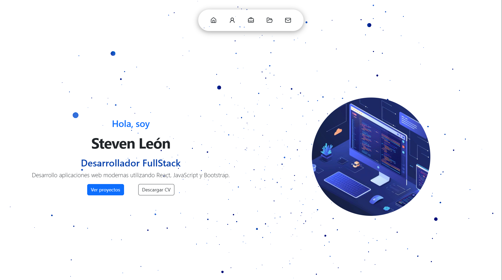
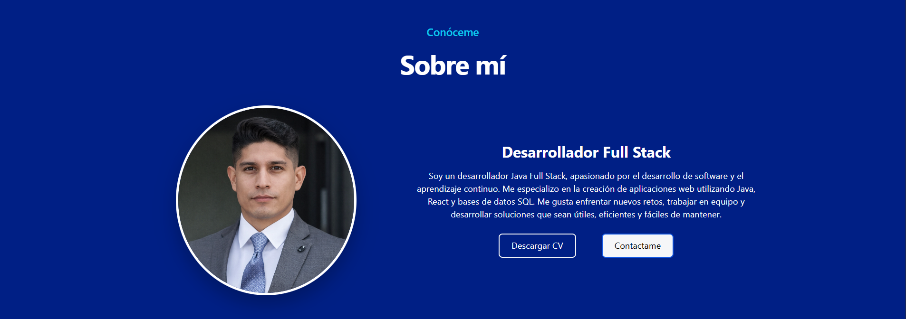
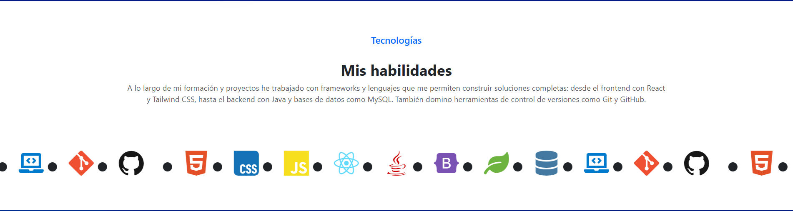
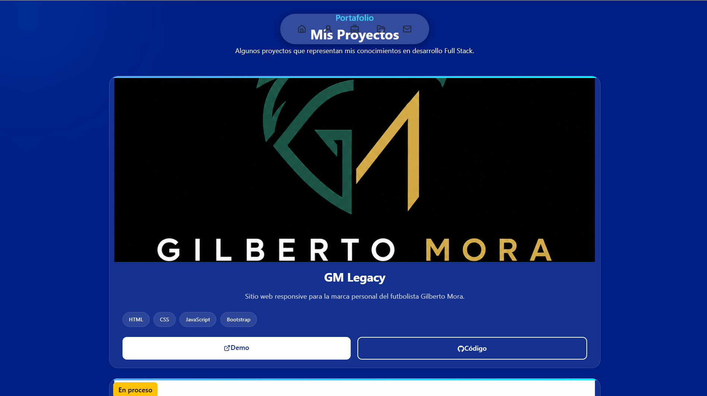
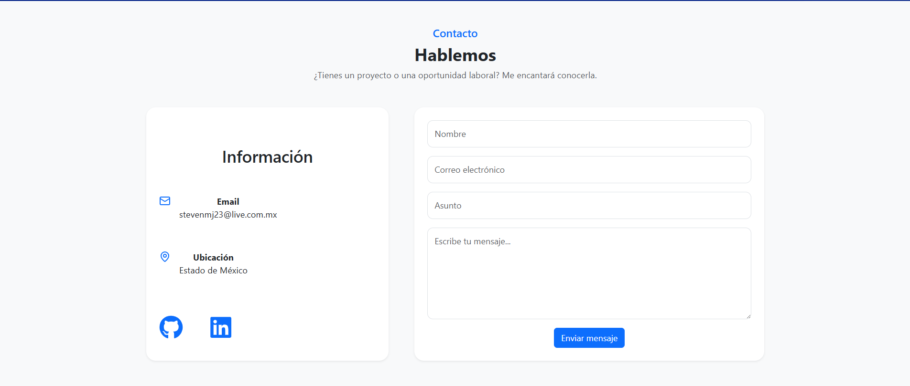

<div align="center">

# 💼 Portafolio Personal

# Steven León Rodríguez

### Ingeniero en Sistemas Computacionales | Desarrollador Full Stack Jr.

<p>
Mi portafolio profesional desarrollado con <strong>React + Vite</strong>, donde presento mis habilidades, experiencia y proyectos personales enfocados en el desarrollo web moderno.
</p>

<p>
Mi objetivo es seguir creciendo como desarrollador Full Stack, construyendo aplicaciones escalables, con interfaces intuitivas y código limpio.
</p>

---

## 🚀 Demo en vivo

### 🌐 https://superfier.github.io/PortafolioSteve/

---

## 💻 Tecnologías


</div>

---

# 📸 Vista previa

> **Aquí puedes colocar un GIF navegando por el sitio (recomendado).**

<p align="center">


</p>

---

# 📷 Capturas

## 🏠 Inicio



---

## 👨‍💻 Sobre mí



---

## 🛠 Habilidades



---

## 📂 Proyectos



---

## 📬 Contacto



---

# 👋 Sobre mí

Soy **Steven León Rodríguez**, Ingeniero en Sistemas Computacionales apasionado por el desarrollo de software y la creación de soluciones web modernas.

Actualmente continúo fortaleciendo mis conocimientos en **Java**, **Spring Boot**, **React**, **JavaScript** y bases de datos, desarrollando proyectos que me permiten aplicar buenas prácticas de programación, diseño responsivo y arquitectura de software.

Mi objetivo es incorporarme a un equipo de desarrollo donde pueda seguir aprendiendo, aportar soluciones de calidad y crecer profesionalmente como **Desarrollador Full Stack**.

---

# ✨ Características

- ⚛️ Desarrollado con React + Vite
- 🎨 Diseño moderno y minimalista
- 📱 Responsive Design
- 🌌 Fondo interactivo con partículas
- 🧩 Componentes reutilizables
- 📂 Sección de proyectos
- 📄 Descarga de CV
- 📬 Información de contacto
- 🚀 Optimización para rendimiento
- 💻 Código limpio y organizado

---

# 💻 Tech Stack

<p align="center">


</p>

---

# 🛠 Tecnologías utilizadas

## Frontend

- React
- Vite
- JavaScript (ES6+)
- HTML5
- CSS3
- Bootstrap 5

## Backend (Aprendiendo)

- Java
- Spring Boot

## Bases de datos

- MySQL

## Herramientas

- Git
- GitHub
- Visual Studio Code

---

# 📂 Estructura del proyecto

```text
PortafolioSteve
│
├── public/
│   ├── cv.pdf
│   └── favicon.ico
│
├── src/
│   ├── assets/
│   │   ├── images/
│   │   └── icons/
│   │
│   ├── components/
│   │   ├── Navbar.jsx
│   │   ├── Hero.jsx
│   │   ├── About.jsx
│   │   ├── Skills.jsx
│   │   ├── Projects.jsx
│   │   ├── Contact.jsx
│   │   └── Footer.jsx
│   │
│   ├── styles/
│   ├── App.jsx
│   └── main.jsx
│
├── package.json
└── README.md
```

---

# ⚙️ Instalación

### Clonar repositorio

```bash
git clone https://github.com/Superfier/PortafolioSteve.git
```

### Entrar al proyecto

```bash
cd PortafolioSteve
```

### Instalar dependencias

```bash
npm install
```

### Ejecutar en desarrollo

```bash
npm run dev
```

### Generar versión de producción

```bash
npm run build
```

---

# 📌 Secciones del sitio

- 🏠 Inicio
- 👨‍💻 Sobre mí
- 🛠 Habilidades
- 📂 Proyectos
- 📞 Contacto

---

# 📚 Lo que aprendí

Durante el desarrollo de este proyecto reforcé conocimientos en:

- Desarrollo de interfaces modernas con React.
- Organización de componentes reutilizables.
- Responsive Design utilizando Bootstrap y CSS.
- Optimización del rendimiento.
- Integración de librerías externas.
- Control de versiones con Git y GitHub.
- Publicación de proyectos mediante GitHub Pages.
- Mejores prácticas para la creación de un portafolio profesional.

---

# 🚀 Roadmap

- ✅ Crear mi portafolio profesional.
- ✅ Publicarlo en GitHub Pages.
- ✅ Implementar navegación responsiva.
- ✅ Agregar animaciones y efectos visuales.
- 🔄 Añadir nuevos proyectos.
- 🔄 Implementar modo oscuro.
- 🔄 Internacionalización (Español / Inglés).
- 🔄 Integrar EmailJS.
- 🔄 Conectar proyectos con APIs REST.
- 🔄 Agregar proyectos desarrollados con Spring Boot.

---

# 🎯 Objetivo

Este proyecto tiene como finalidad servir como mi carta de presentación profesional, demostrando mis habilidades técnicas, capacidad de aprendizaje y evolución como desarrollador.

---

# 🤝 Contribuciones

Si deseas proponer alguna mejora, puedes realizar un **Fork** del proyecto y enviar un **Pull Request**.

Toda sugerencia es bienvenida.

---

# 📄 Licencia

Este proyecto está bajo la licencia **MIT**.

Puedes utilizar el código como referencia para fines educativos.

---

<div align="center">

# 👨‍💻 Steven León Rodríguez

### Ingeniero en Sistemas Computacionales

### Desarrollador Full Stack Jr.

---

## 🌐 Contacto

[](https://superfier.github.io/PortafolioSteve/)

[](https://www.linkedin.com/in/steven-leon-rodriguez/)

[](https://github.com/Superfier)

[](mailto:stevenmj23@live.com.mx)

---

## ⭐ ¡Gracias por visitar este repositorio!

Si este proyecto te resultó interesante, considera dejar una ⭐ para apoyar mi trabajo.

**¡Toda retroalimentación es bienvenida!**

</div>
